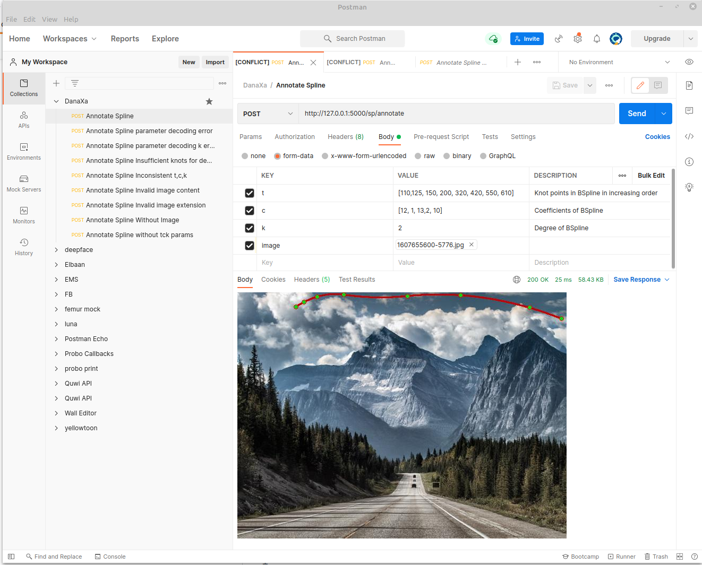

[TOC]
## Danaxa Spline Image Annotator

This program has been designed with Flask to annotate an image with spline requests with tck parameters and attached image.


### 1. Clone 

To make a copy of [code](https://github.com/bijanpiri/spline) run 

`$ git clone https://github.com/bijanpiri/spline.git`

You can also use above git page to download source as a zip file if you like.

### 2. Create and activate virtual environment

It is better to create a virtual environment to avoid package conflicts.

```
$ cd spline
$ python -m venv env
$ source env/bin/activate
```

or on Windows cmd:
```
> py -3 -m venv env
> env\Scripts\activate.bat

```
### 3. Install dependencies

To install related packages that are necessary to run this program execute:

`$ pip install`

while `env` virtual environment is activated.

### 4. Run flask web service

on linux execute:

```
$ export FLASK_APP=spline_vs
$ export FLASK_ENV=development
$ flask run
```

on windows run:

```
> set FLASK_APP=spline_vs
> set FLASK_ENV=development
> flask run
```


When you run above command successfully it will show you following response

```
 * Serving Flask app 'spline_vs' (lazy loading)
 * Environment: production
   WARNING: This is a development server. Do not use it in a production deployment.
   Use a production WSGI server instead.
 * Debug mode: off
 * Running on http://127.0.0.1:5000/ (Press CTRL+C to quit)
```
Which last line tell us it is running on localhost/127.0.0.1 and port 5000. 

If you open [127.0.0.1:5000](http://127.0.0.1:5000) you will see a page containing DanaXa Image Annotator message that means service is running.  

But in order to test spline visualization you need to make a **POST** request to __`/sp/annotate`__. Annotate endpoint has this address because I have put it under blueprint "spline_vs" which use __`/sp`__ as address prefix.

Flask blueprint are like Django apps that make it easier to write reusable codes like python packages.


### 5. Test with Postman

I have created **POST** requests to test different test case including invalid post request. 

If you want to test this web service using postman you can create different request like bellow.



As you can see I have filled post body form-data with an image field(as a Jpeg image file) and t,c,k values like:
```
t = [110,125, 150, 200, 320, 420, 550, 610]
c = [12, 1, 13,2, 10]
k = 2
```

And It responded with image that has got a spline on it.
Other requests in postman collections are invalid request to make sure we are handling requests correctly.

I have included postman json file in project directory which can be found in [docs/postman/DanaXa.postman_annotate_spline.json](docs/postman/DanaXa.postman_annotate_spline.json) path 
or save and import json.
[https://www.getpostman.com/collections/9bdc152a34f9d862077e](https://www.getpostman.com/collections/9bdc152a34f9d862077e).

Please attach your desired image file for image field before sending POST requests because it has not been encoded in postman json files.

### 6. Test with pytest and coverage

I have written 11 tests for annotating image with tck parameter and image which you can run by

```
 $ pytest -v
```
or
```
$ python -m pytest -v
```
And it will respond with 

```
=========================================================== test session starts ===========================================================
platform linux -- Python 3.8.8, pytest-6.2.5, py-1.10.0, pluggy-1.0.0 -- /home/bijan/projects/danaxa/spline/env/bin/python3
cachedir: .pytest_cache
rootdir: /home/bijan/projects/danaxa/spline
collected 11 items                                                                                                                        

tests/test_spline.py::test_spline_annotate_image_bad_extension PASSED                                                               [  9%]
tests/test_spline.py::test_spline_annotate_image PASSED                                                                             [ 18%]
tests/test_spline.py::test_spline_annotate_image_corrupted_content PASSED                                                           [ 27%]
tests/test_spline.py::test_spline_annotate_without_image PASSED                                                                     [ 36%]
tests/test_spline.py::test_spline_annotate_bad_tck[tck0-Knot points not found] PASSED                                               [ 45%]
tests/test_spline.py::test_spline_annotate_bad_tck[tck1-No coefficient has been set] PASSED                                         [ 54%]
tests/test_spline.py::test_spline_annotate_bad_tck[tck2-Degree of spline has not been sent] PASSED                                  [ 63%]
tests/test_spline.py::test_spline_annotate_bad_tck[tck3-Error parsing request parameters] PASSED                                    [ 72%]
tests/test_spline.py::test_spline_annotate_bad_tck[tck4-invalid literal for int() ] PASSED                                          [ 81%]
tests/test_spline.py::test_spline_annotate_bad_tck[tck5-Knots, coefficients and degree are inconsistent] PASSED                     [ 90%]
tests/test_spline.py::test_spline_annotate_bad_tck[tck6-Need at least 6 knots for degree 2] PASSED                                  [100%]

=========================================================== 11 passed in 0.70s ============================================================

```

You can also test if it has enough coverage by executing:

```
$ coverage run -m pytest -v
$ coverage report
```
It will respond with coverage report table as shown below:

```
Name                    Stmts   Miss  Cover
-------------------------------------------
spline_vs/__init__.py      18      3    83%
spline_vs/config.py         2      0   100%
spline_vs/spline.py        55      0   100%
tests/__init__.py           0      0   100%
tests/test_spline.py       47      0   100%
-------------------------------------------
TOTAL                     122      3    98%

```

